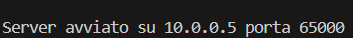
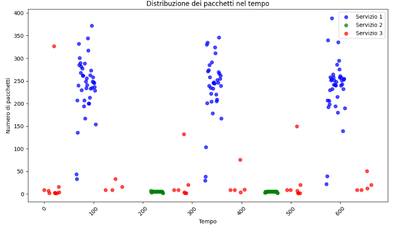

# Traffic prediction in SDN networks
## Table of Contents
- [Project Introduction](#project-Introduction)
- [Technology used](#Technology-used)
- [Project Structure](#Project-Structure)
- [The topology of the network](#The-topology-of-the-network)
- [Docker images](#Docker-images)
- [Running example of the network](#Running-example-of-the-network)
    - [The Streaming service](#The-Streaming-service)
    - [The Bank service](#The-Bank-service)
    - [The Echo-chat service](#The-Echo-chat-service)
    - [Saving the Pcap file](#Saving-the-Pcap-file)
- [Machine learning models](#Machine-learning-models)
    - [Traffic prediction model](#Traffic-prediction-model)
    - [Packets length prediction model](#Packets-length-prediction-model)
## Project Introduction
This project aims to develop an artificial intelligence application capable of analyzing network traffic captures generated using a Mininet topology.  
The application leverages machine learning models to predict specific network characteristics: the number of packets exchanged and the length of the exchanged packets.  
The primary goal is to provide an advanced tool for predictive network analysis, enabling users to extract key insights about traffic characteristics directly from raw data.   
This solution is designed to support activities such as network performance monitoring, diagnostics, and traffic flow optimization.  
The project integrates a simulated network environment (Mininet) to generate realistic traffic and AI models that process traffic captures in pcap format to deliver accurate predictions.  

## Technology used
The tecnology used in this project are:  
- Comnetsemu: A comprehensive network emulator equipped with all the necessary tools to support the execution of the project.  
- Mininet: A flexible network emulator that enables the design and simulation of customized network topologies.  
- Python: The primary programming language used to implement both the network logic and controller operations.
- Scikit-learn: A very popular library to create, train, and test machine learning models.
- Google colab: Environment provided by Google to execute programs using Google's integrated GPUs.
- Wireshark: A well-established application to analyze the pcap capture files, to check the correct execution of the network.
- Scapy: A python library used to extract features from packets saved in pcap files.

## Project Structure
The structure of the project is as follows (DA FARE PER ULTIMO):  

## The topology of the network
The structure of the network is the following:  

- 5 host  
    - 2 clients named h1 and h2  
    - 3 different servers named h3, h4 and h5.  
## Docker images
This project comprises 5 different docker images that are instanciated inside of the different hosts. 
The first image is the clients' image `complete_client`, this image is created starting from an `ubuntu:20.04` image, then are downloaded the most important services for the client side, being python and ffmpeg, and other utilities.
Then,  inside the /home/ directory are copied the following scripts:
- `viewer.sh`: Bash script to connect to a streaming server.
- `client_bank.py`: Python script to connect to the bank service server and send operations read from the operations.txt file.
- `operations.txt`: Being a txt file containing fixed operations specific for the bank server.
- `client_chat_h1.py`: Being the python script used from the first client to connect to the echo-chat server, which sends random words as input.
- `client_chat_h2.py`: Being the second client's script to connect to the echo-chat server, these are differentiated as the server requires authentication to ensure two clients are connected. 

This image is deployed in both the clients, to make sure that they have access to the same services.

Then, the `dev_test` image is a base image based on `ubuntu:20.04` which contains the main utilities for networking projects, such as iperf, tcpdump and others.
This image is used as a testing image for the hosts.

Then, the `bank_server` image, is used to deploy the banking service server, it contains the common networking and python utilities, and is based on the `ubuntu:20.04` image.
The host exposes port 65000 to permit connections from other hosts.
In the `home` directory is copied the python script `server.py`, which deploys the server on the exposed port and processes the payload of the requests.
This image is only deployed in h4.

Then, the `echo_server` image, similarly to the bank one, contains the most common utilities for python and networking, exposes port 65000 and copies the `server.py` script.
This image is deployed in h5.

Then, the `streaming_server` is based on the latest release of `tiangolo/nginx-rtmp`, which is a very popular docker image for streaming services.
It copies the nginx.conf file, the terminal script to start the streaming and the video to stream.
Port 1935 is exposed. This service is deployed in h3.

## Running example of the network
In order to run the application and test the network you have first to download Comnetsemu from this repository 'https://git.comnets.net/public-repo/comnetsemu', then import the project inside Comnetsemu, and finally navigate into the `Networking-Project`. Then, it is required to instaciate all the docker images by executing the command `sudo ./build.sh`.

At this point you can run the network by digiting the command `sudo phyton3 topology.py`  

Now, it is required to open another terminal in order to capture the traffic with tcpdump, execute in the new terminal the command `sudo tcpdump -i s2-eth1 -w s2_eth1.pcap`. This command will start sniffing the traffic on the first interface of the second switch.  

  

If the execution is correct, a new file named `s2_eth1.pcap` will appear in the current directory.    

  

You can now switch back to the first terminal and run the services in any order you desire.  

## The streaming service
In order to start the server of the stream it is required to navigate to the /home/ directory of h3 with `h3 cd home` and then executing the streaming script `h3 ./stream.sh`. To execute the service as a subprocess, it is possible to execute `h3 ./stream.sh &` so that it will be printed "starting the stream..." and the terminal will not be blocked by the execution.   
 
  

If the execution is correct, the following output will appear, with the current timestamp of the video playing by the server. Note: only if the service was not executed with the `&` flag.  

  

If the service was executed without the `&` flag , with `control-c` it is possible to quit the h3 host terminal without killing the process. Then, start the client using the following two command `h1 cd home` and finally execute the viewer command `h1 ./stream.sh`, that will connect the client host to the stream and create an `output.mp4` file, containing the captured seconds of the stream, both video and audio are captured. This service is deployed using ffmpeg, a popular library for deployment of streaming services.  
The output will contain the amount of data received and the timestamp of the stream.
Note that you can use the `h2` client aswell, as the images deployed to the clients are the same, meaning they both contain the same scripts to connect to all the servers. It is possible to connect both the clients to the same stream.  

  

In order to quit the stream as the client, you can just type `q`,  so the `ouput.mp4` file will be generated.  
We reccomend to let the client view the stream for at least 30 second in order to capture enough traffic.  
If you want to run the stream twice on the same client and capture the traffic, it is possible to overwrite the `output.mp4` file. A possible bug related to `ffmpeg`'s implementation may occurr, related to 2 frames, being video and audio, being captured at the same time. In this case, it is possible to restart the service and the bug should not be happening again.   

## The Bank service
First you have to navigate in the `/home/` directory of the h4 client, and then execute the server python3 script with the following command `h4 python3 server.py`, it is possible to add the `&` as the streaming service to execute as a subprocess.
If the execution is correct, the following output will be printed, containing information of the server listening.  

   

If the execution of the service didn't comprise the `&` flag, the `control-c` will exit the terminal of the server without killing the process, then it is possible to start the client by navigating to the /home/ directory and execute the client bank script `h1 python3 client_bank.py`.  
Note that you can use the `h2` client aswell.   

If the execution is correct, the following output will appear, with the client doing some prefixed operations.

  

After finishing the operations containted in the `operations.txt` file, the server will close the connection.

## The Echo-chat service
Firstly, it is required to navigate to the /home/ directory with `h5 cd home`, then  execute the echo server script `h5 python3 server.py`, as for the two previous services it is possible to execute as subprocess with the `&` flag.  
If the execution is correct, the following output will appear related to the the server listening.   

As per the other services if the execution did not comprise the `&` flag, `control-c` command will quit the terminal without killing the process. Then, start the first client by navigating to the /home/ directory with `h1 cd home` and then execute the h1 client script `h1 python3 client_chat_h1.py`.  
If the execution is correct, following output will appear, with the first client waiting to do some operation.  

   

Now it is required to connect the second client, so after quitting the first client's terminal with `control-c`, it is required to start the second client by navigating to h2's /home/ directory with `h2 cd home` and then start the second client's script with `h2 python3 client_chat_h2.py`.  
If the execution is correct, the following output will appear with the second client waiting to do some operations.  

   

Now wait a couple of second and it will appear a similar output with some random messages received from host 1.  

   

Then the host 2 will try to send some random messages aswell.

    

After a while the server will close both the connections.

## Saving the Pcap file
Once you are done with creating traffic you can switch to the second terminal and just type `control-c` to kill the tcpdump command, it will appear the following output with the number of the packets captured by the filter.  

    

Now you can easily download your pcap file by right-clicking on the file and downloading.  

  

## Machine learning models
For this project the main idea was to develop a machine learning model that could in any way predict the traffic inside the network.
The two models proposed have different approaches in both the idea of training and prediction.

## Traffic prediction model
The first model's idea is that to predict the number of packets that are travelling inside the network, given a time and a service. This model was developed inside google colab's environment.
The starting dataset comprised a pcap file generated using all the services in a random pattern as training set and a second pcap file as validation set. The packets contained in the pcap files are then preprocessed by checking the timestamp and grouping them based on the time of travel and the service.
The service is defined based on the IP addresses of the servers, if a packet has one of the servers' address as src or dst, a counter of the corresponding timestamp is incremented. Then, a flag is set to 1 for one of the features `ServiceType_1`, `ServiceType_2` or `ServiceType_3`, as the services are one hot encoded to make the learning easier for the model.

Then, the `Time` feature is normalized to make the values feasible for the model to learn. The polinomial regression model is then trained, by using a polinomial transformation on the training set to obtain a more complex prediction and the `TotalPackets` feature as label.
During the training the training set is split in 80% and 20%, a first test is done on the latter to understand if the model is solving the task. Furthermore, it is shown a simple prediction made on the second after the end of the training set.

Then, it is possible to check on the graphs printed the distribution of the training set and the predictions done by the model.

As the graphs show the model is understanding the pattern with a Mean Squared Error of 2360.

At last, the model is validated on the validation set, the graph shows the prediction of the model over the distribution of the data.

## Packets length prediction model
The second model proposed is trained with a real-time approach, meaning that the model is trained in a server that is connected to the network, the latter located inside a virtual machine.
This model is able to predict the length of the packets arriving, given the `src_ip`, `dst_ip` and `protocol`.
At first, the `server_training_RT.py` is executed, this will start a server listening to any interface on the port 6343. Then, inside the virtual machine is executed the topology and the tcpdump command, together with netcat, to direct the traffic captured to the python server: `sudo tcpdump -i s2-eth1 -w - | nc <IP_address> <port>`.
To connect the host machine with the virtual machine the interface `bridge100` was used.

Then, once the connection is confirmed by the server, it is possible to start creating the traffic inside the network, with the commands explained in the [Running example of the network](#Running-example-of-the-network) chapter.
While the packets arrive to the server, a real-time graph is updated each second, showing the distribution of the arriving packets length over time.

During this phase the arriving packets are written in a temporary file. Once the traffic is done, the file is read and the packets analyzed and given as input to the `Stochastic gradient descent regressor`.
The packets are preprocessed with one hot encoding over the `IP_src`, `IP_dst` and `protocol`.

The model is so trained with the traffic and saved.
Then, the `validation.py` script is executed, using the saved model to execute predictions over the validation set and the coefficient of determination is calculated.
The result obtained is a model capable of predicting the length of any given packet with a coefficient of determination (R^2) of 0.73 over the validation set.

    

